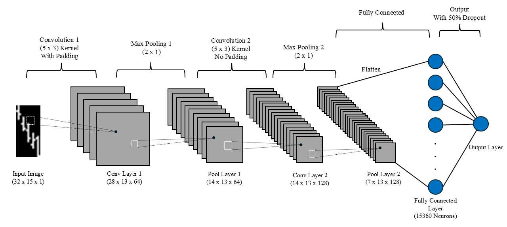
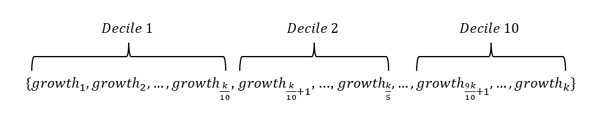

# More Information on Project

This file goes over data acquisition, model architecture, and model's results in more detail. To better understand or go more in depth, please refer to the "(Re-)Imag(in)ing Price Trends" paper in the reference section of the README file.

## Data Acquisition
The original paper acquired approximately 4,000 daily stock data listed on NASDAQ, NYSE, and AMEX from the CRSP database. These stocks trends ranged from 1993 - 2019. However, due to not having access to CRSP data, I've used Yahoo Finance to acquire all the datasets. 

A list of tickers was obtained from "Python Basics". I filtered the list based on their years on the market (in the 1993 - 2019 range) and removed the tickers that were deprecated in Yahoo Finance. After this process, I was left with a list of 1,092 tickers. I used Yahoo Finance's Python package, `yfinance`, to obtain the stock data for each of the 1,092 firms. 

```python
import yfinance as yf

## Download Apple's stock data from 1993 to 2019.
yf.download('AAPL', '1993-01-01', '2019-12-31')
```

## Data Preprocessing
I followed the preprocessing guidelines proposed in the paper. This included adjusting all the open, high, low, and closing prices by the adjustment factor and normalizing all prices using the closing price of the first day of the training period. Without considering the effect stock splits, dividends, etc into the data, the model may not learn the true stock trend of a firm. Therefore, adjusting the returns was done in order to view the total return to shareholders. In doing so, I was able to measure the stock's consistent performance over time. 

Normalizing prices can help the model focus more on the dimensionless trend of the stock price rather than the changes in the absolute value. Doing this allows the model to learn all OHLC stock trends for different firms as it's analyzing the relative change of price.

After adjusting and normalizing the price changes for each firm, I added a moving average line. This was done by using the Exponentially Weighted Moving Average (EWMA) formula. `pandas` had a built-in function that allowed me to compute and integrate the EWMA into the dataset.

The preprocessed dataset was then saved as `csv` files for each firm.

The formulas and parameters used for this process is documented in the `Create_Images.ipynb` notebook.

## Generating Custom OHLC Images
Before converting the stock trends of each firm into images, I first had to group them into forecasts. I've defined the groups as $n$-day images (stock trend across $n$ days) to predict the following $m$-day holding period returns. The notation $InRm$ is used in the paper and in this project. For example, the $I20R5$ group would store images that depict the stock trend across 20 days and predict the returns after 5 days. After creating groups from the combinations formed using 5, 20, and 60 days, I was left with 9 groups. Images were created for all data in these groups.

In order for the model to better understand the changes of the OHLC graph, the paper converted the image into binary (black pixels for the background, white pixels for the OHLC trend line). 

The width of a $n$-day image was $3n$ pixels. Hence, a five day trend would be 15 pixels, a twenty day trend would be 60 pixels, and a sixty day trend would be 180 pixels. 

The height of a $n$-day image would be in increments of 32 pixels. For a five day trend image, the height would be 32 pixels, a twenty day trend image would have a height of 64 pixels, and a sixty day trend image would have a height of 96 pixels.

For the one day bar with a width of 3 pixels, the high and low prices are depicted as a vertical white line drawn in the middle of the bar. The opening price is represented as a one pixel horizontal line on the left of the bar while the closing is drawn as a one pixel horizontal line on the right of the bar. 

The moving average line was drawn by adding one white pixel in the middle of the bar depicting one day and connecting those dots. This was done for all the days present in the image.

If the volume bar was present, the entire graph would be moved up accordingly and a one pixel space would be included between the stock trend and the volume bars. Below are the dimensions for each interval days with volume bars.
 - Five days: (Prices: 25 pixels), (Volume: 6 pixels)
 - Twenty days: (Prices: 51 pixels), (Volume: 12 pixels)
 - Sixty days: (Prices: 76 pixels), (Volume: 19 pixels)

The generated images from this project are shown below.

<p align="center">
  
</p>

<p align="center">
  <em>
    The images created by this project. The figures in the first row show the images for different intervals while the figures in the second row show the variations of the I60 image with moving average line and volume bars.
  </em>
</p>

## Artificial Images (For a Quick Model Test)
In order to make sure the model is able to detect the trend patterns, the paper used the Head and Shoulders Top (HNST) and Head and Shoulders Bottom (HNSB) trajectories. The HNST pattern indicates a drop in prices while the HNSB indicates a rise in prices. These patterns were converted into OHLC images and used for training to make sure the model detected these simple patterns.

Unfortunately, these patterns exist over a long period such as a 20 day time frame (my computer couldn't train the 20 day models due to their complexity). Hence, I created a sinusoidal function with random noise to act as the artificial trend pattern. Using these images, I was able to train the model to around 97% accuracy, showing that the model was able to learn patterns in price trend. This is shown more in the `Train_Model.ipynb` notebook.

## Model Architecture
The models proposed in the paper were developed in order to learn the shape of the stock price trend. The convolutional filter of the model is able to capture very small changes of the graph and the "non-linear spatial associations among various price curves" [1]. By applying these convolutional filters, or kernels, the model can learn if the graph undergoes no change, small increase, or large increase. These features learned at a low level using the convolutional filter are then combined using fully connected neurons in order to learn more complex and abstract features. The architectures of the $I5$ model is shown below (please view the paper for the rest of the models' design).

<p align="center">
  
</p>

<p align="center">
  <em>
    The architecture of the I5 CNN model proposed in the paper. I created this image to showcase the architecture in more depth.
  </em>
</p>

The first convolutional layers uses a (5 x 3) kernel, horizontal stride of one and a vertical stride of three, includes padding, and outputs 64 channels. Then, the convolutional layer undergoes max pooling, with kernel shape of (2 x 1). The second convolutional layers uses (5 x 3) kernel with the same stride, no padding, and outputs 128 channels. This layer then goes through max pooling once more under the same parameters. The resulting layers are flattened and inputted into a fully connected layer with 15,360 neurons. All these neurons then undergo dropout of 50%, and then connected to the output layer with one neuron. The activation function for the output layer is a sigmoid function (paper uses softmax). Each convolutional layer undergoes batch normalization and uses Leaky ReLU for their non-linear activation function. 

## Model Training
For the training process, I randomly selected 70% of images for training and 30% for validation. The training and validation dataset consists of images from 1993 - 2006. The original paper only uses image samples from 1993 - 2000, but because I have a smaller dataset, I had to increase the timeframe to get any meaningful results.

The weights for the model are initialized using Xavier initializer. I also used the Adam Optimizer with an initial learning rate of $1$ x $10^{-5}$ and a batch size of 128. The binary cross entropy function was used for the model's loss function.

A detailed documentation of training the model is stored in the `Train_Model.ipynb` notebook.

## Model Results and Evaluation
Each image has its subsequent return value for the following five, twenty or sixty days. An array containing these values are created, with the number of firms being the columns and the number of intervals being the rows. An example is shown below.

<p align="center">
  
</p>

<p align="center">
  <em>
    The return array where l is the number of intervals and k is the number of firms.
  </em>
</p>

After this step, a similar array is created except this array contains the predicted probability of the stock going up for each image. These probabilities are then sorted in ascending order for each row. 

<p align="center">
  
</p>

<p align="center">
  <em>
    The predicted array hypothetically sorted. The variable p depicts the probability hierarchy, with p1 containing the lowest probabilities and pk containing the highest probabilities.
  </em>
</p>

The original indices of the firms are saved while sorting and applied to the return array in order to obtain the true return values of each prediction. 

<p align="center">
  
</p>

<p align="center">
  <em>
    The return array sorted based on their respective predicted probabilities.
  </em>
</p>

Then the Compound Annual Growth Rate (CAGR) was computed based on the overall growth that the prediction group of each $p$ column had over 7 years. This process is documented in detail in the `Model_Evaluation.ipynb` notebook. 

After obtaining our average annual growth rate for each $p$ column, I equally separated the growth rates into deciles. Within each decile, the grouped growth rates are then averaged to get the average annual growth rate for that decile. Hence, if the model performed correctly, the growth rates should be reflective on the decile index. Decile 1 should have the least amount of growth, decile 2 the second least amount of growth, and decile 10 having the highest amount of growth. Porforlios were constructed based on Equal Weight criterion.

<p align="center">
  
</p>

<p align="center">
  <em>
    Shows the grouping of deciles of annual growth rates per p column.
  </em>
</p>

Subsequently, I could obtain a decile portfolio depicting the annual growth rates similar to the portfolio presented in the paper. Below shows the $I5R5$ decile portfolio from this project and the paper. 

<div align="center">
  <table style="margin: 0 auto; border-collapse: collapse;">
    <thead>
      <tr>
        <th></th>
        <th>Project Growth Rates</th>
        <th>Paper Growth Rates</th>
      </tr>
    </thead>
    <tbody>
      <tr>
        <td>Low</td>
        <td>-0.27</td>
        <td>-0.28</td>
      </tr>
      <tr>
        <td>2</td>
        <td>0.01</td>
        <td>-0.04</td>
      </tr>
      <tr>
        <td>3</td>
        <td>0.02</td>
        <td>0.03</td>
      </tr>
      <tr>
        <td>4</td>
        <td>0.06</td>
        <td>0.08</td>
      </tr>
      <tr>
        <td>5</td>
        <td>0.11</td>
        <td>0.09</td>
      </tr>
      <tr>
        <td>6</td>
        <td>0.14</td>
        <td>0.14</td>
      </tr>
      <tr>
        <td>7</td>
        <td>0.18</td>
        <td>0.17</td>
      </tr>
      <tr>
        <td>8</td>
        <td>0.25</td>
        <td>0.22</td>
      </tr>
      <tr>
        <td>9</td>
        <td>0.32</td>
        <td>0.30</td>
      </tr>
      <tr>
        <td>High</td>
        <td>0.42</td>
        <td>0.54</td>
      </tr>
    </tbody>
  </table>
</div>


<p align="center">
  <em>
    Compares the annual growths compiled from this project and the paper. 
  </em>
</p>

We can see that the results from this project is quite similar to the ones reported in the original paper. While there are still some discrepancies, discrepancies can most likely decrease with using more datasets. Furthermore, this is the average annual growth. When applying the model to individual years, the performance isn't as accurate as depicted in the above table (there are some fluctuations in returns per decile). Thus I strongly recommend against using my code for actual stock investment. Please refer to the `Model_Evaluation.ipynb` notebook for more detail on the decile portfolio results.
